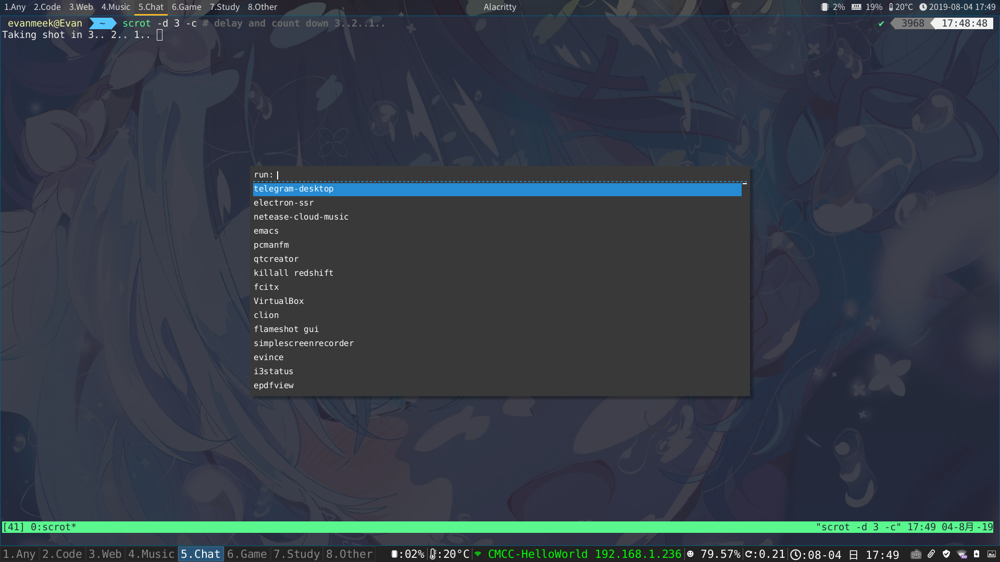

# My Linux Vanilla

这个仓库几乎包含了我所用到的所有软件的配置文件.

你可以直接使用，有好的建议欢迎提交 __pull request__.

## 必备字体

~~~
sudo pacman -S ttf-font-awesome wqy-bitmapfont wqy-microhei wqy-microhei wqy-zenhei nerd-fonts-complete
~~~

## i3wm

## 常用快捷键

| 按键                     | 说明                                     |
|--------------------------|------------------------------------------|
| $mod+u                   | 设置边框存在                             |
| $mod+y                   | 设置边框像素为1                          |
| $mod+n                   | 设置边框隐藏                             |
| $mod+Return(回车键)      | 打开alacritty终端                        |
| $mod+Shift+Return        | 通过alacritty打开ranger                  |
| $mod+Control+g           | 打开Chrome                               |
| $mod+Controll+f          | 打开Firefox                              |
| $mod+Shift+q             | 杀死聚焦窗口                             |
| $mod+d                   | 打开rofi                                 |
| $mod+h+j+k+l             | 将聚焦在窗口之间切换                     |
| $mdo+上下左右            | 同上，只不过用的是方向键                 |
| $mod+Shift+h+j+k+l       | 将聚焦窗口改变排列位置                   |
| $mod+Shift+上下左右      | 同上，只不过用的是方向键                 |
| $mod+b                   | 切换至上一个工作区                       |
| $mod+Shift+b             | 将上一个工作区的容器，移动至当前工作区内 |
| $mod+q                   | 切换平铺方式                             |
| $mod+f                   | 将聚焦窗口全屏                           |
| $mod+s                   | 容器窗口排列方式为堆叠式                 |
| $mod+w                   | 容器窗口排列方式为标签式                 |
| $mod+e                   | 容器窗口排列方式为平铺式                 |
| $mod+Shift+space(空格键) | 切换容器窗口为平铺还是浮动               |
| $mod+space               | 在浮动或平铺窗口之间进行聚焦的切换       |
| $mod+Ctrl+左或右         | 切换工作区，前或后                       |
| $mod+1-8                 | 切换工作区                               |
| $mod+Ctrl+1-8            | 将当前容器的窗口移动至某个工作区         |
| $mod+Shift+1-8           | 将当前容器移动至某个工作区               |
| $mod+Shift+r             | 重启i3                                   |
| $mod+Shift+c             | 重载i3配置文件                           |
| $mod+0                   | 进入系统模式                             |
| l                        | 系统模式:锁屏                            |
| s                        | 系统模式:挂出                            |
| u                        | 系统模式:切换用户                        |
| e                        | 系统模式:登出                            |
| h                        | 系统模式:休眠                            |
| r                        | 系统模式:重启                            |
| Shift+s                  | 系统模式:关机                            |
| $mod+r                   | 进入窗口大小设置模式                     |
| h j k l                  | 设置窗口上下左右的大小                   |
| 上下左右                 | 同上                                     |
| Return                   | 退出窗口大小设置模式                     |

## 特定程序特定打开

若想添加，需要使用`xprop`获取窗口`class`值，进行设置。

~~~
sudo pacman -S xprop
~~~

例如:

~~~
# 执行这行命令会出现一个十状指针，点击需要设置的窗口，就会将窗口的CLASS至输出了。
xprop | grep "CLASS"
~~~

设置例子:

~~~

assign [class="TelegramDesktop"] $ws5 #Telegram
assign [class="firefox"] $ws3 #Firefox
assign [class="Google-chrome"] $ws3 #Chrome
assign [class="netease-cloud-music"] $ws4 #网易云音乐
assign [class="jetbrains-clion"] $ws2 #CLion
assign [class="Emacs"] $ws2 #Emacs
assign [class="Epdfview"] $ws7 #pdf
~~~

## i3status

此配置需要放置`$HOME`下，若想使用`Polybar`需要将`i3 config`文件中的`bar`那一区域内容注释，并且搜索`Polybar`那一行，取消注释，保存+重载i3即可.

## Polybar

此配置需要放置`$HOME/.config/`下，每次重载i3时，Polybar会启动.

## rofi

我使用`rofi`作为`i3`的程序启动器，`rofi`的样式在`Xresources`的`ROFI Color theme`注释下

